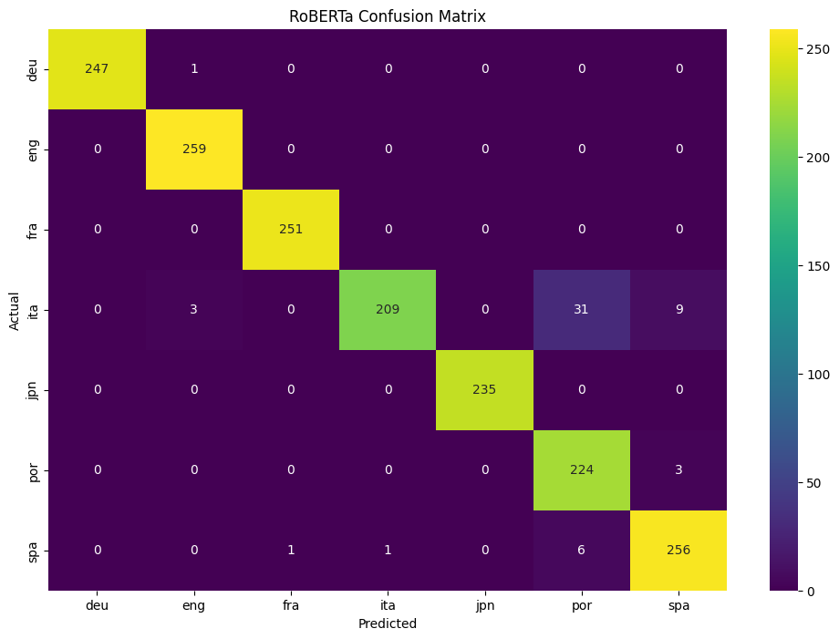

# Multi-Language Identifier 🔍
This project focuses on comparing the language identification performance of three well-known transformer models—RoBERTa, BERT, and DistilBERT—on a multilingual dataset. These models were evaluated based on metrics such as accuracy, precision, and recall, to determine which one is most effective at identifying languages from short text samples.

# Models Used
1. RoBERTa
2. BERT
3. DistilBERT
   
# Dataset
The dataset used for training and evaluation consists of multilingual text samples in languages including English, Portuguese, Spanish, Italian, and German. Each sample was pre-processed and tokenized using the appropriate tokenizer for the models.

# Results

## Overview 


***Accuracy:***  
- RoBERTa: 96.83%  
- DistilBERT: 95.10%  
- BERT: 77.65%

***Precision:***  
- RoBERTa: 97.11%  
- DistilBERT: 95.61%  
- BERT: 73.98%  

***Recall:***  
- RoBERTa: 96.83%  
- DistilBERT: 95.10%  
- BERT: 77.65%  

# Performance Summary:
RoBERTa performed the best overall, especially in handling language pairs like Portuguese and Spanish, although it had minor confusion between Portuguese and Italian.
DistilBERT performed closely to RoBERTa but had slightly more difficulty distinguishing between English and German.
BERT underperformed compared to the other two models, with more confusion across multiple languages.

# Confusion Matrices




  


# Installation
To replicate this project, install the required dependencies using the following command:

```
pip install -r requirements.txt
```

# Usage
Run the notebook to train the models on the multilingual dataset and evaluate their performance:

```
jupyter notebook LanguageIdentifier.ipynb
```

# Conclusion
The results show that RoBERTa is the most effective model for multilingual language identification, with high scores across all metrics. DistilBERT is a good alternative with slightly less accuracy, while BERT struggled in comparison.

#License
This project is licensed under the MIT License.

You can customize this further based on your project needs! ​
